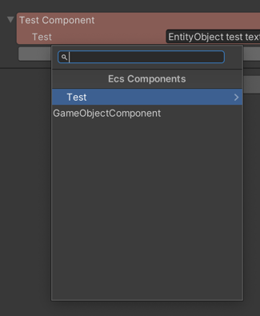

# Интеграция в редактор Unity для библиотеки LeoECS Lite
Интеграция в редактор Unity с более простым взаимодествием с игровыми объектами

# Содержание
* [Установка](#Установка)
  * [В виде unity модуля](#В-виде-unity-модуля)
  * [В виде исходного кода](#В-виде-исходного-кода)
* [Основные типы](#Основные-типы)
  * [EcsWorldComponent](#EcsWorldComponent)
  * [EcsEntityComponent](#EcsEntityComponent)
  * [Аттрибут EcsComponentAttribute](#Аттрибут-EcsComponentAttribute)
  * [UnityComponent\<T\>](#UnityComponent\<T\>)
* [Лицензия](#Лицензия)

# Установка

> **ВАЖНО!** Зависит от [LeoECS Lite](https://github.com/Leopotam/ecslite) - фреймворк должен быть установлен до этого расширения.

## В виде unity модуля
Поддерживается установка в виде unity-модуля через git-ссылку в PackageManager или прямое редактирование `Packages/manifest.json`:
```
"com.tripolis.inc.ecspackage": "https://github.com/Tripolis-Inc/LeoECS-Unity-Integration.git",
```

## В виде исходного кода
Код можно так же можно просто добавить в проект, скопировал или скачав архив.

# Основные типы

## EcsWorldComponent
Абстрактный компонент Unity, отвечающий за работу с миром в ECS. Позволяет добавить необходимые для мира система и инициализировать SharedData для мира. 
Этот компонент по иерархии должен находит находиться над всеми ECSEntityComponent, которые в него добавятся.
```c#
public class TestWorldComponent : EcsWorldComponent
{
    // Добавление необходимых для мира систем
    protected override void PopulateSystems(IEcsSystems systems)
    {
        systems.Add(new TestSystem());
        systems.Add(new SecondTestSystem());
        systems.Add(new CreateObjectSystem());
    }

    // Инициализация SharedData для мира
    protected override object GetSharedData() => null;
}
```

## EcsEntityComponent
Основной компонент Unity связывающий сущность ECS с GameObject. Может хранить в себе заданные компоненты. Иницилизируется на Start ивент, и добавляется в установленный или ближайший в родителе EcsWorldComponent. Массив Unity Component на иницилизации создает компоненты UnityComponent<T>, и связывает их с ECS Entity.  


## Аттрибут EcsComponentAttribute
Помечает ECS компонент для возможности его добавления и отображегия в инспесторе у компонента Unity - EcsEntityComponent
```c#
// Первый аргумент аттрибута отвечает за отображение назначания компонента в инспекторе
// Второй аргумент аттрибута отвечает за отображение компонента в окне добавления
[EcsComponent("Test Second", "Test/Second Test")]
[Serializable]
public struct SomethingECSComponent
{
...
}
```
> **ВАЖНО!** Для отрисовка объекта в инспекторе, он должен быть сериализуемым.


## UnityComponent\<T\>
Не сериализуемый ECS компонент. Не отображается в инспекторе. Можно использовать для быстрого доступа к компонентам GameObject, и их последующего кеширования.

# Лицензия
Фреймворк выпускается под лицензией MIT, [подробнее](./LICENSE.md).